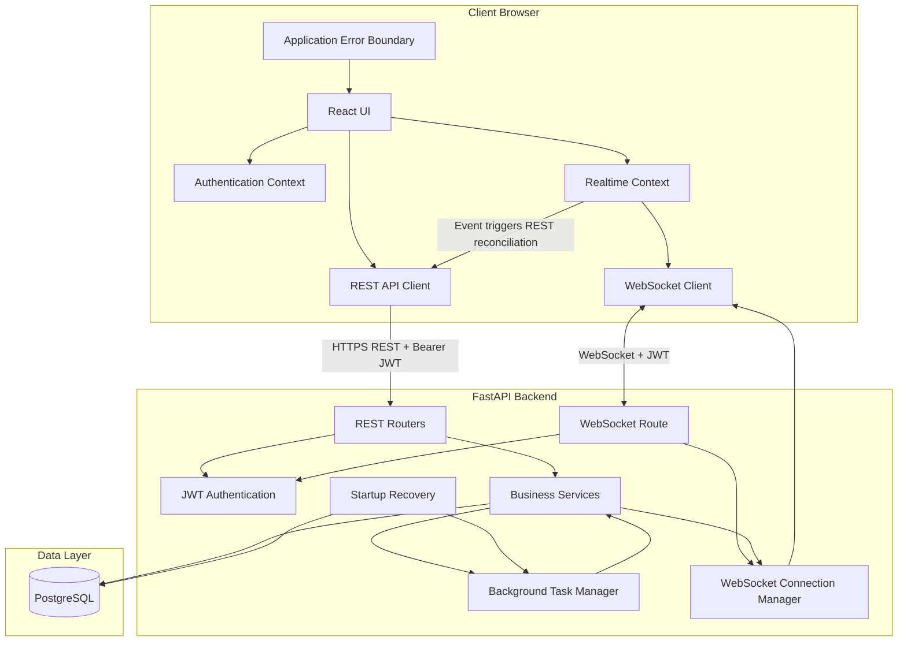
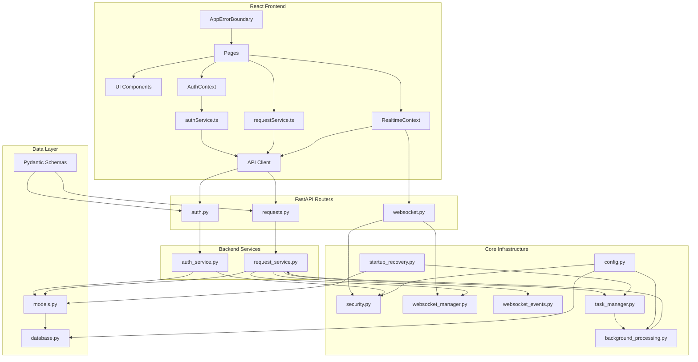
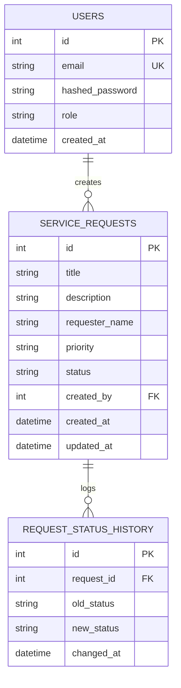
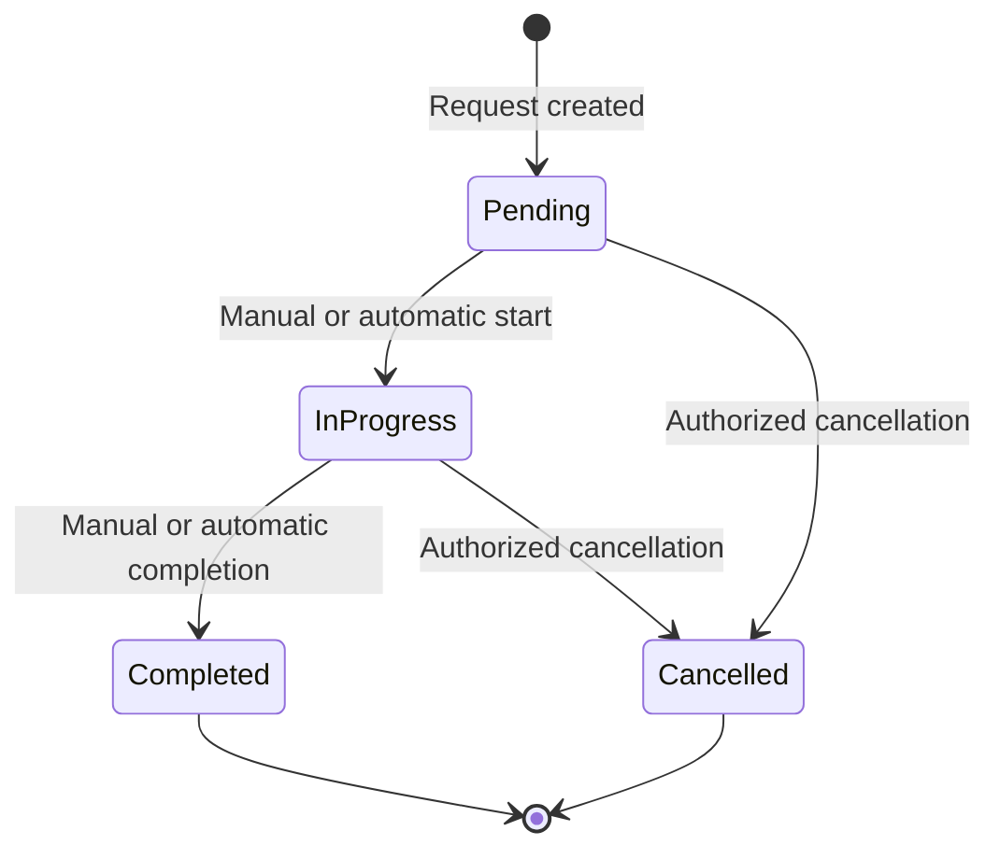
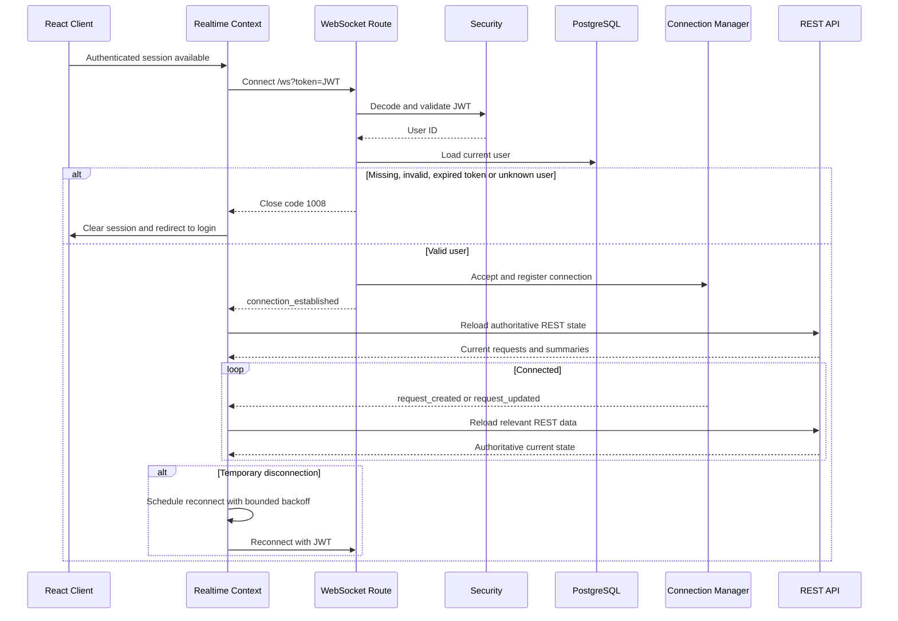
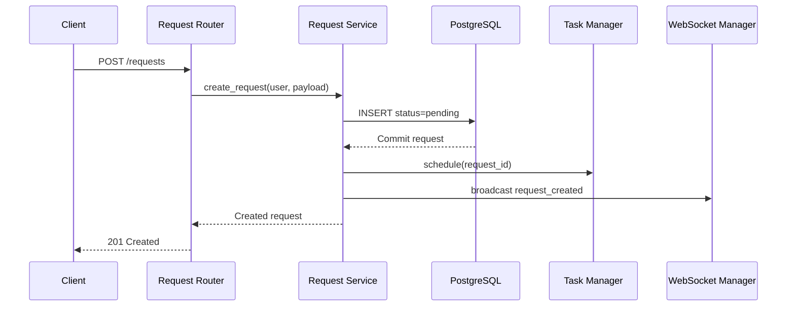
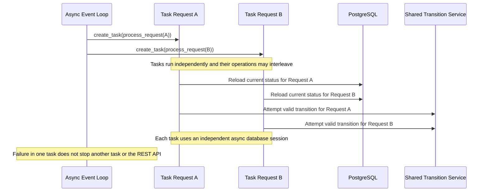
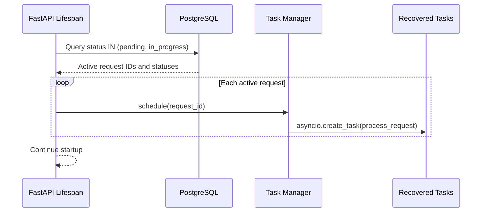
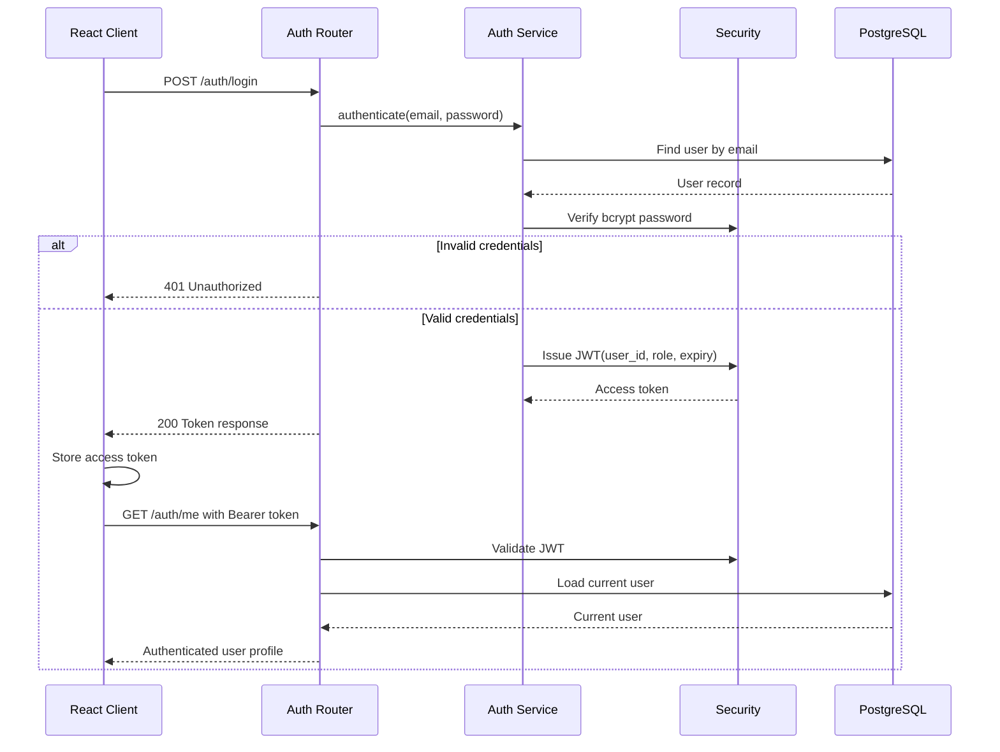
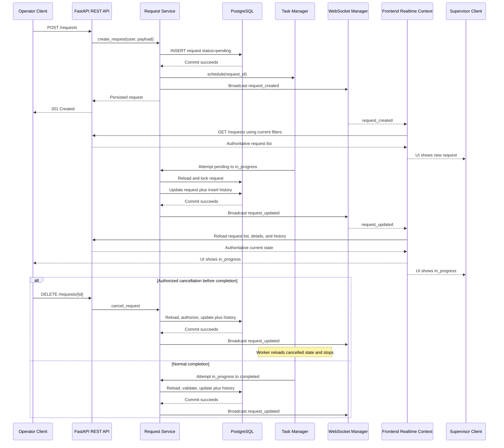

## Real-Time Service Request Management System: System Design

## 1\. Technology Stack and Justification

| Layer | Technology | Justification |
| --- | --- | --- |
| Backend framework | **FastAPI (Python)** | Native async support, Pydantic validation, OpenAPI generation, lifecycle hooks, and native WebSockets. |
| Database | **PostgreSQL** | Durable relational storage, constraints, foreign keys, and a reliable source of truth for restart recovery. |
| ORM | **SQLAlchemy async** | Async database access with testable models and transaction boundaries. |
| Authentication | **JWT (**`**python-jose**`**) + bcrypt (**`**passlib**`**)** | Stateless authentication works for both REST and WebSocket access. |
| Real-time communication | **Native FastAPI WebSockets** | Meets the real-time requirement without adding Socket.IO. |
| Concurrency and recovery | `**asyncio.create_task**` **+ FastAPI lifespan/startup hook** | Enables independent non-blocking tasks and rescheduling of persisted active requests after restart. |
| Frontend | **React with Vite** | Component-based interface and minimal tooling overhead. |
| Styling | **Tailwind CSS** | Supports the required responsive polished dashboard design. |
| Frontend state | **React hooks and Context** | Sufficient for authentication, request state, live summaries, and WebSocket state without Redux or another external state library. |

## 2\. High-Level Architecture



PostgreSQL is authoritative. WebSocket messages notify clients that state changed; the frontend then reloads authoritative REST data using its active filters. The task manager contains only local runtime task references and can be rebuilt from the database after restart.

## 3\. Component Design



### 3.1 Responsibilities

#### Routers

*   Parse HTTP or WebSocket input.
*   Resolve the current authenticated user.
*   Call service functions.
*   Return HTTP responses or WebSocket connection outcomes.
*   Contain no ownership, transition, or persistence rules.

#### Services

*   Authenticate credentials.
*   Create and query requests.
*   Enforce Operator ownership and Supervisor permissions.
*   Validate status transitions.
*   Persist request and history changes transactionally.
*   Trigger WebSocket broadcasts after successful commits.
*   Coordinate task scheduling.

#### Core

*   Read environment configuration.
*   Hash passwords and issue/validate JWTs.
*   Track WebSocket connections.
*   Track running background tasks by request ID.
*   Recover persisted active requests at startup.

#### Data layer

*   Define SQLAlchemy models and relationships.
*   Define Pydantic input/output schemas.
*   Provide async sessions and engine lifecycle.

#### Frontend

*   Present protected login, dashboard, request list, details, history, filters, and permission-aware controls.
*   Manage authentication and WebSocket state through React Context.
*   Treat real-time events as change notifications and reconcile through REST.
*   Provide responsive loading, empty, conflict, permission, offline, and runtime-recovery states.

## 4\. Database Design

### 4.1 Entity relationship diagram



### 4.2 Constraints

#### `users`

*   `email`: unique and non-null.
*   `hashed_password`: non-null.
*   `role`: constrained to `operator` or `supervisor`.

#### `service_requests`

*   `title`, `description`, and `requester_name`: non-null and validated for non-blank values.
*   `priority`: constrained to `low`, `medium`, or `high`.
*   `status`: constrained to `pending`, `in_progress`, `completed`, or `cancelled`.
*   `created_by`: non-null foreign key to `users.id`.
*   `updated_at`: updated on every successful status change.

#### `request_status_history`

*   `request_id`: non-null foreign key to `service_requests.id`.
*   `old_status` and `new_status`: constrained to valid status values.
*   One history row is created for each successful status transition.

### 4.3 Consistency boundary

The request status update, `updated_at` change, and history insertion occur in one database transaction. The WebSocket event is sent only after the transaction commits successfully. This prevents clients from receiving an update that was not persisted.

## 5\. Authorization Matrix

| Operation | Operator | Supervisor |
| --- | --- | --- |
| Create request | Allowed | Allowed |
| List all requests | Allowed | Allowed |
| View request details/history | Allowed | Allowed |
| Manually update own request | Allowed if non-terminal and transition is valid | Allowed |
| Manually update another user's request | Forbidden | Allowed if non-terminal and transition is valid |
| Cancel own request | Allowed if `pending` or `in_progress` | Allowed |
| Cancel another user's request | Forbidden | Allowed if `pending` or `in_progress` |
| Update/cancel `completed` request | Forbidden | Forbidden |
| Update/cancel `cancelled` request | Forbidden | Forbidden |

The backend service layer enforces this matrix. The frontend may hide unavailable controls but is not a security boundary.

## 6\. Status Transition Design

### 6.1 State diagram



### 6.2 Transition table

| Current status | Requested status | Valid | Notes |
| --- | --- | --- | --- |
| `pending` | `in_progress` | Yes | Manual or automatic |
| `pending` | `cancelled` | Yes | Must satisfy authorization |
| `in_progress` | `completed` | Yes | Manual or automatic |
| `in_progress` | `cancelled` | Yes | Must satisfy authorization |
| Any status | Same status | No | No-op transitions are rejected |
| `pending` | `completed` | No | Cannot skip processing |
| `in_progress` | `pending` | No | Backward transition prohibited |
| `completed` | Any status | No | Terminal |
| `cancelled` | Any status | No | Terminal |

A single service-layer function validates and executes all manual and automatic transitions.

## 7\. API Design

All endpoints except `/auth/login` require `Authorization: Bearer <token>`.

| Method | Endpoint | Purpose | Authorization |
| --- | --- | --- | --- |
| POST | `/auth/login` | Authenticate and issue JWT | Public |
| GET | `/auth/me` | Return current user | Any authenticated user |
| POST | `/requests` | Create a request | Any authenticated user |
| GET | `/requests` | List/search/filter requests | Any authenticated user |
| GET | `/requests/{id}` | Get request details | Any authenticated user |
| PATCH | `/requests/{id}/status` | Perform a valid manual status transition | Operator owns request; Supervisor any request |
| GET | `/requests/{id}/history` | Get status history | Any authenticated user |
| DELETE | `/requests/{id}` | Cancel request by transitioning to `cancelled` | Operator owns request; Supervisor any request |
| WS | `/ws?token=<jwt>` | Receive live events | Any authenticated user |

### 7.1 Create request

**Request**

```json
{
  "title": "Printer not working",
  "description": "The third-floor printer is jammed.",
  "requester_name": "Ayesha Rahman",
  "priority": "medium"
}
```

**Response —** `**201 Created**`

```json
{
  "id": 42,
  "title": "Printer not working",
  "description": "The third-floor printer is jammed.",
  "requester_name": "Ayesha Rahman",
  "priority": "medium",
  "status": "pending",
  "created_by": 3,
  "created_at": "2026-07-10T09:15:00Z",
  "updated_at": "2026-07-10T09:15:00Z",
  "creator": {
    "id": 3,
    "email": "operator@example.com"
  }
}
```

### 7.2 List query parameters

```
GET /requests?status=in_progress&priority=high&q=ayesha
```

*   `status`: optional valid status.
*   `priority`: optional valid priority.
*   `q`: optional case-insensitive keyword search across title, description, and requester name.

### 7.3 Manual status update

**Request**

```json
{
  "status": "in_progress"
}
```

Possible outcomes:

*   `200 OK`: transition succeeded.
*   `403 Forbidden`: Operator does not own the request.
*   `404 Not Found`: request does not exist.
*   `409 Conflict`: request is terminal or transition is invalid.
*   `422 Unprocessable Entity`: malformed or unknown status value.

### 7.4 Cancellation

`DELETE /requests/{id}` performs a soft cancellation transition; it does not remove the row.

Possible outcomes:

*   `200 OK`: request changed to `cancelled`.
*   `403 Forbidden`: Operator does not own the request.
*   `404 Not Found`: request does not exist.
*   `409 Conflict`: request is already terminal.

## 8\. WebSocket Design

### 8.1 Connection and recovery flow



### 8.2 Event types

#### `connection_established`

Sent immediately after a JWT-authenticated WebSocket connection is accepted. It contains the authenticated user ID and role. The frontend uses it to confirm connectivity and reconcile REST state after initial connection or reconnection.

```json
{
  "type": "connection_established",
  "data": {
    "user_id": 1,
    "role": "operator"
  }
}
```

#### `request_created`

Sent after a new request is committed. The payload contains the newly created request fields needed for notification and immediate presentation.

#### `request_updated`

Sent after a successful status transition is committed.

```json
{
  "type": "request_updated",
  "data": {
    "id": 42,
    "status": "in_progress",
    "updated_at": "2026-07-10T09:16:00Z"
  }
}
```

The frontend treats WebSocket messages as change notifications. After `request_created` or `request_updated`, it reloads the authoritative request collection through REST using the current search and filters, then recalculates summaries. After `connection_established`, it also reloads state to recover events missed while disconnected.

### 8.3 Frontend reconnection policy

*   Non-authentication disconnects trigger automatic reconnection.
*   Reconnection uses exponential backoff beginning at approximately one second and capped at approximately fifteen seconds.
*   Close code `1008` is treated as an authentication failure and logs the user out rather than reconnecting.
*   Logout and component cleanup close the socket and cancel pending reconnect timers.
*   Connection state is shown as connecting, live, reconnecting, or offline.

## 9\. Concurrent Processing Design

### 9.1 New request flow



Scheduling is non-blocking. The API does not wait for automatic processing to finish.

### 9.2 Independent tasks



### 9.3 Task registry

The task manager maintains an in-memory dictionary similar to:

```
request_id -> asyncio.Task
```

Before scheduling, it checks whether a non-finished local task already exists for that request. Completed tasks remove themselves from the registry through a done callback.

This registry prevents duplicate local scheduling but is not durable. Durability comes from PostgreSQL and startup recovery.

## 10\. Automatic Transition Algorithm

Conceptual behavior for `process_request(request_id)`:

1.  Open a new async database session.
2.  Load the current request from PostgreSQL.
3.  Stop if missing, `completed`, or `cancelled`.
4.  If `pending`, wait for the configured pending-processing delay.
5.  Reload the request.
6.  Attempt `pending` → `in_progress` through the shared transition service.
7.  Stop if the request changed manually, was cancelled, or is otherwise no longer eligible.
8.  Wait for the configured completion delay.
9.  Reload the request.
10.  Attempt `in_progress` → `completed` through the shared transition service.
11.  Catch and log task-level failures without crashing the application.

For a recovered request already in `in_progress`, the worker begins at the completion stage rather than resetting it to `pending`.

The reload before every transition prevents a background task from completing a request that a user already cancelled or completed.

## 11\. Startup Recovery Design

### 11.1 Recovery flow



### 11.2 Recovery rules

*   Recovery runs after the database connection is available and before normal application operation is considered ready.
*   Only `pending` and `in_progress` requests are rescheduled.
*   `completed` and `cancelled` requests are never rescheduled.
*   The persisted status determines the recovery stage.
*   The task manager's duplicate check is used for both new and recovered requests.
*   Every task still reloads current state before transitions, so recovery remains safe if a user changes a request shortly after startup.
*   During shutdown, the application closes WebSocket clients, cancels and awaits local background tasks, and then disposes the database engine.

### 11.3 Assignment-level limitation

This design preserves request state and resumes logical processing after restart, but it does not preserve the exact remaining sleep duration. A recovered task begins a new configured delay for its persisted stage. This limitation is acceptable for the simulated assignment workflow and must be documented in the README.

## 12\. Race and Consistency Handling

Manual actions and background tasks may attempt to change the same request close together. The implementation must ensure that only a transition valid for the latest persisted state succeeds.

The simplest acceptable approach is:

1.  Reload the request inside the transition service.
2.  Validate current status, requested status, role, and ownership.
3.  Update the request and insert history within one transaction.
4.  Commit.
5.  Broadcast only after commit.

For stronger protection, the update may include the expected current status in its database condition. If another transition wins first, the affected-row count is zero and the service returns a conflict instead of overwriting the newer state.

## 13\. Authentication Flow



The JWT identity is used to derive `created_by` and enforce ownership. The client must never submit a trusted creator ID. During normal use, an authenticated REST `401` or WebSocket close code `1008` clears the frontend session and requires login again.

## 14\. End-to-End Lifecycle



## 15\. Recommended Backend Structure

```
backend/
├── app/
│   ├── main.py
│   ├── api/
│   │   ├── auth.py
│   │   ├── requests.py
│   │   └── websocket.py
│   ├── core/
│   │   ├── background_processing.py
│   │   ├── config.py
│   │   ├── security.py
│   │   ├── startup_recovery.py
│   │   ├── task_manager.py
│   │   ├── websocket_events.py
│   │   └── websocket_manager.py
│   ├── db/
│   │   ├── database.py
│   │   └── models.py
│   ├── schemas/
│   │   ├── auth.py
│   │   └── requests.py
│   └── services/
│       ├── auth_service.py
│       └── request_service.py
├── tests/
├── .env.example
└── requirements.txt
```

The exact filenames may vary slightly, but the architectural responsibilities must remain separated.

## 16\. Recommended Frontend Structure

```
frontend/src/
├── components/
│   ├── auth/
│   ├── errors/
│   ├── layout/
│   ├── realtime/
│   ├── requests/
│   └── ui/
├── contexts/
│   ├── AuthContext.tsx
│   └── RealtimeContext.tsx
├── hooks/
├── lib/
├── pages/
├── services/
└── types/
```

The frontend separates presentation components, pages, API services, reusable hooks, domain types, and shared authentication/realtime state.

## 17\. Configuration and Lifecycle

*   Database URL, JWT settings, token lifetime, processing delays, API host/port, and frontend CORS origins are environment-driven.
*   Frontend CORS origins are supplied as a comma-separated setting and parsed into an allowlist, supporting development and preview origins.
*   The frontend derives `ws://` or `wss://` from the configured API base URL instead of maintaining a separate WebSocket endpoint setting.
*   On shutdown, WebSocket clients are closed first, background tasks are cancelled and awaited second, and the database engine is disposed last.

## 18\. Frontend Recovery and Error Handling

*   A global React error boundary prevents unexplained white screens after render failures.
*   The API client raises structured errors containing HTTP status and backend detail.
*   Authenticated REST `401` responses notify the authentication Context to clear the session.
*   Request screens distinguish network failure, permission denial, missing resources, state conflicts, and validation errors.
*   Reconnecting and offline states are visible to the user, while existing persisted data remains available.

## 19\. Design Summary

The design uses PostgreSQL as the durable source of truth, a shared service-layer transition function for both manual and automatic changes, and an `asyncio` task manager for non-blocking processing. Ownership and role rules are explicit, `requester_name` is present throughout the data model and API, terminal states are protected, and active requests are safely rescheduled at startup. Status persistence and history are committed before WebSocket broadcast. The frontend treats those broadcasts as change notifications and reconciles through REST, keeping the database, audit trail, filtered views, dashboard summaries, and live interface consistent.